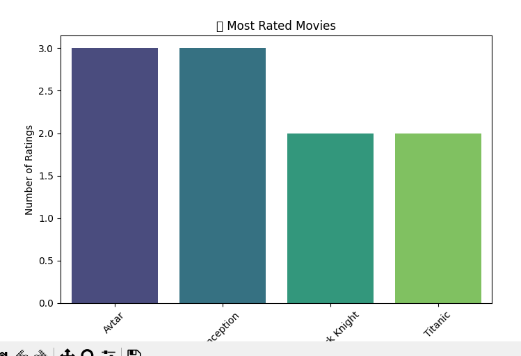
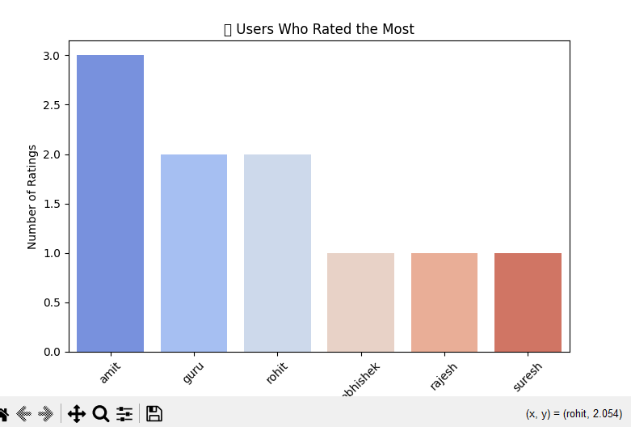

# Movie Ratings Analysis


## 📌 Project Overview
This project analyzes movie ratings using Python libraries like **Pandas, Matplotlib, and Seaborn**. It provides insights into:
- 🔥 The most-rated movies
- 🎬 Average ratings of movies
- 👑 Users who rated the most movies

## 📂 Dataset
The dataset contains user ratings for various movies. It includes:
- `user`: ID of the user who rated the movie
- `movie`: Name of the movie
- `rating`: Rating given by the user

## 🚀 Features
✅ Data Cleaning (Handling missing values)
✅ Calculating average ratings per movie
✅ Identifying most-rated movies
✅ Finding top users who rated the most
✅ Visualizing insights with bar charts

## 📊 Visualizations
### 🔥 Most Rated Movies


### 👑 Users Who Rated the Most



## 🛠️ Installation & Setup
Clone this repository and install dependencies:
```bash
# Clone the repository
git clone https://github.com/mehtaricha-23/movie-ratings-analysis.git

# Navigate to the project directory
cd movie-ratings-analysis

# Install dependencies
pip install pandas matplotlib seaborn
```

## 🏃‍♂️ Run the Analysis
```bash
python movie_rating_analysis.py
```

## 📂 Output Files
After running the script, the following processed CSV files will be generated:
- `average_ratings.csv` - Average ratings of movies
- `most_rating.csv` - Most rated movies
- `top_user.csv` - UsMovie-Ratings-Analysis.
ers who rated the most

## 📌 Contributing
Feel free to fork this repository, make improvements, and submit a pull request!

## 📝 License
This project is open-source and available under the **MIT License**.

---
🎬 **Happy Analyzing!**
